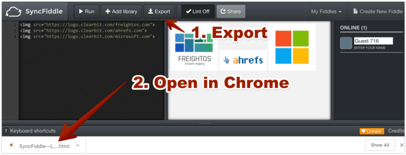

This one is going to be short but sweet.

I constantly find myself needing to aggregate dozens of logos from email
address domains (customers, event attendees, whatever). I have a great
[Keyboard Maestro](https://www.keyboardmaestro.com/main/) macro for grabbing
Google Image results for transparent logos but that still requires doing one
at a time.

### Until today.

I’m going to walk you through a two minute process to grab any number of logos
and either export as one large image or save each individual logo, all from a
list of emails. The tools? A Google Sheet (link at the end of the post),
[Clearbit](https://clearbit.com), and a live HTML rendering tool called
[SyncFiddle](http://syncfiddle.net).

## How to bulk convert emails into logos.

Here’s the deal.

Clearbit has a great API for automatically pulling logos from company names.
But that doesn’t make it very easy to create pictures of multiple logos and
requires another tool to actually aggregate. So I use Google Sheets to
generate HTML of the images, and a live online rendering tool to actually
create the images of all the logos together. That same tool lets you export
the individual logos en masse.

Ready?

My workflow goes like this:

1\. Drop a list of customer email addresses into Google Sheets

2\. The sheet will extract domain names and create the HTML for each logo
using Clearbit’s awesome (and free) API.

3\. Since Clearbit doesn’t have logos for _everything_ , the sheet uses a
custom script (getStatusCode) to make sure the image exists. It also kills any
free emails, which will mess up your logos. This does mean that you’ll need to
approve the code to run. No funny shtuff.

4\. Use the second tab to grab the logo URLs or HTML format.

5\. If you’d like to just grab one big picture of all the logos, copy the HTML
head to SyncFiddle, click “Create New Fiddle”, erase the left-most box, and
paste the URL HTML. Then click “Run”. You should see the logos on the right –
grab a screenshot. You’re done.

6\. If you want each
logo saved as a separate file, export the SyncFiddle file, open the file in
your browser, click File->Save Page As…”, and save as an HTML page. A folder
should be saved in your downloads folder with all the logos.

Pretty simple, right?

**Grab (and copy) the Google sheet
right[here](https://docs.google.com/spreadsheets/d/1Gi_x6tzeVTn0R-7twKv815wOsB7Kyd9LR77ky_dWoA4/copy).**

