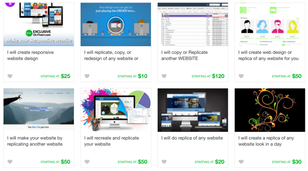

[84% of Americans](http://www.journalism.org/2016/12/15/many-americans-
believe-fake-news-is-sowing-confusion/) think they know the difference between
fake news and real news. They’re wrong. A Buzzfeed survey found that [75% of
Americans](https://www.buzzfeed.com/craigsilverman/fake-news-
survey?utm_term=.lxeZVm8VD#.nanWZ8MZD) have been fooled.

We may be on the lookout but fake news _still_ penetrates our hardened
Internet attention defenses. This is an unmitigated disaster for media
producers and consumers, but a gold mine for marketers, especially those who
hold content near and dear.

Fake News’s impact is proof that in an [oversaturated
world](https://www.buchman.co.il/life-for-marketers-is-about-to-get-harder-
heres-why/), creators with even low-quality content can get their message into
the New York Times…or [convince the free world’s
media](https://www.engadget.com/2017/03/10/wikileaks-cia-cache-fool-me-once/)
that WhatsApp has been hacked.

### Here’s the things. Google algorithms are winning the war on black-hat
SEO’ers. Now it has to deal with **black-hat content creators**.

This information dissemination meltdown brings with it a real education for
content marketers.

Here are six marketing lessons that Fake News drives home. But please, use
these insights for good, not evil.

## #1 Lead Right

Social media is jet fuel for fake news rocket ships. [60% of all shared
links](https://www.washingtonpost.com/news/the-intersect/wp/2016/06/16/six-
in-10-of-you-will-share-this-link-without-reading-it-according-to-a-new-and-
depressing-study/?utm_term=.53e4258c084b) are never clicked (even by the
people who shared them). Headlines are about micro-content consumption,
dictating article success on the merit of 6-10 words.

Balkan teens churning out alternative facts spend their time grabbing other
articles, true or false, and [writing sensationalized
headlines](https://www.buzzfeed.com/craigsilverman/how-macedonia-became-a-
global-hub-for-pro-trump-misinfo?utm_term=.pkDkO8vO1#.ppe26LZ61). Which can
work for even amateurs; Upworthy built a content empire by rewriting and A/B
testing headlines but two of their most explosive articles ever had the
headlines [written by
interns](https://www.slideshare.net/Upworthy/upworthy-10-ways-to-win-the-
internets/41).

**White-Hat Content Lesson:** Content matters. But the micro-content you lead
with – headlines, open-graph info and metadata – are your content’s calling
card.

## #2 Inherited Credibility

Web design is converging.

Think of the ubiquitous startup video with a video background, transparent
menu with outlined call-to-action button. News sites are no different,
creating baseline standards that set expectations and associations. Look at a
[fake news website](https://www.infowars.com/). It feels real. We know anyone
can rip off a design to inherit credibility from an existing schema…but it’s
still effective.

How easy is it to replicate a serious website? [$20 easy, according to
Fiverr](https://www.fiverr.com/search/gigs?utf8=%E2%9C%93&source=guest-
homepage&locale=en&search_in=everywhere&query=replicate+website+deisgn&page=1&filter=auto)

**White-Hat Content Lesson:** Shake the boat if you feel like you can take
it…but form matters. If you’re writing content that wants to be taken
seriously, check out how other serious folk are packaging the content.

## #3 The World Revolves On Social Proof

Content credibility goes through the roof with “real” names and pictures. The
[New York Times’ expose](https://www.nytimes.com/2017/01/18/us/fake-news-
hillary-clinton-cameron-harris.html?_r=0) on Cameron Harris, a busted Fake
News author, dives into how he invented a source.

> “A photograph, he thought, would help erase doubts about his yarn.”

It did. And it sent a story about fraudulent Clinton votes went ballistic.

Kernel of apparent truth, a good story, some fake social prof, and you’re
[good to go](https://www.nytimes.com/2016/11/20/business/media/how-fake-news-
spreads.html). Which is why other fake news sites even use [false attributions
to real people](http://www.atlanticcouncil.org/blogs/ukrainealert/from-fake-
news-to-fake-opinion).

**White-Hat Content Lesson:** : Get real people to talk and use pictures or
videos as force multipliers for testimonials, interviews, and case studies.

## #4 Repetition (Even of Lies) Get To Us.

Let’s say you read something fishy. You keep on reading, getting a little more
skeptical as you go ([Cinnamon Roll Can Explodes Inside Man’s Butt During
Shoplifting Incident](https://empireherald.com/cinnamon-roll-can-explodes-
inside-mans-butt-during-shoplifting-incident/)?! ). Even when you know it’s a
lie, it _still_ impacts you. [Stanford
research](http://www.newyorker.com/magazine/2017/02/27/why-facts-dont-change-
our-minds) showed that when students are taught something, told it was a lie,
and then asked again, their answers sway towards the outright lie.

**White Hat Content Lesson** : Repetition is an incredibly potent tool for
communicating a message. This is from Franklin Roosevelt’s post-Pearl Harbor
speech:

> Yesterday the Japanese Government also launched an attack against Malaya.  
>  Last night Japanese forces attacked Hong Kong.  
>  Last night Japanese forces attacked Guam.  
>  Last night Japanese forces attacked the Philippine Islands.  
>  Last night the Japanese attacked Wake Island.  
>  And this morning the Japanese attacked Midway Island.

## #5 Turning Audiences Into Distributers

The Macedonian content farms couldn’t care less about Trump or Clinton
politics (although they probably do enjoy Alec Baldwin’s SNL impersonation).

So why so many Trump articles? They found that Trump supporters were [4X as
likely](http://www.newyorker.com/magazine/2017/03/06/trump-putin-and-the-new-
cold-war) to share stories than Clinton supporters. By seeding the right
content on Facebook, their stories spread around the world…and advertising
cash flew into their bank accounts.

**White Hat Content Lesson** : Find out how and where your audience shares
information and create the tools that empower sharing there. Your audience has
the potential to be the best distribution force multiplier.

## #6 Confirmation Bias

We love when we’re right and will go pretty far to prove it.

Give someone a problem, get the answer, and ask if they want to change it.
Only 15% will. But when people are given their own answer and told it was
_someone else’s answer_ , suddenly
[60%](http://www.newyorker.com/magazine/2017/02/27/why-facts-dont-change-our-
minds) will change it.

We think that our opinion, by virtue of being our opinion, is right.

Confirmation bias show how bad we are at assessing facts that don’t jive with
our narrative. Successful Fake News stories played into what readers wanted to
hear, triggered, triggering that “I _knew_ it!” reaction.

**White Hat Content Lesson** : Make your reader your hero. Give them the “ _I
knew it_ ” moments but also deliver the “ _aha_ ” moments as well. Resonating
on an emotional level is critical for good storytelling. And good storytelling
is critical for great content.

* * *

Fake news isn’t going anywhere.

Let’s use _our_ incredible content – together with brilliant distribution and
writing – to make their life a little harder.

##

