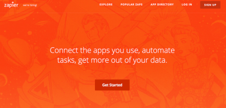

**The I’m-too-busy-to-read-this overview:**

  * Get to know your high-expectation user who can recognize maximum product benefit.
  * A brand that speaks your users’ language is a force multiplier.
  * Experiencing user pain first-hand is a must to nail product messaging.
  * Find the forums where your users spend time. Spend all day there.
  * Run every copy, visual, and email past the “if I said this to their face, would I need to slap myself” test.
  * Use Zapier. It’s awesome.

Earlier this week, someone at [Zapier](http://zapier.com) reached out to me
for a user research call. Zapier is more important to me than many blood
relatives, so I clicked their calendly link to schedule a call.

But just 16 hours after the email was sent, **every slot was booked**.

Users were literally lining up to spend 30 minutes on the phone with Zapier.
For free.

That’s customer devotion. And it got me thinking…

## How the heck does Zapier invoke that kind of customer love?

The answer? Zapier gets the concept of [Job To Be
Done](https://www.useronboard.com/ryan-singer-user-onboarding-jtbd/), selling
me on what I want to grow into (a speed-demon marketer) instead of on a
product (let’s connect APIs).

Automating marketing makes me feel like I hold the key to Castle Efficiency,
to the extent that I recently spent a full hour glowing about my favorite Zaps
to a marketing buddy (thanks for listening, Liz!).

**Zapier makes me a superhero.**

But there are a plenty of great tools that can’t get people to line up for 30
minute research calls. What does Zapier do differently?

## It combines a great product with a user-tailored brand.

Yes, Zapier is awesome.

It has a fantastic UX and provides functionality that most neglect, like
[Push](https://zapier.com/help/push/) and
[Formatter](https://zapier.com/help/formatter/). Plus, early integrations
triggered a virtuous cycle that has many companies now launching with built-in
Zapier support.

But that’s not enough.

Zapier has obsessed customers because it built the perfect brand for its core
users.

[Julia Supan](https://www.linkedin.com/in/juliesupan), a go-to-market
specialist who’s helped Airbnb and Dropbox, talks about launching by building
a product for a **high-expectation customer** :

> “The high-expectation customer, or HXC, is the most discerning person within
> your target demographic. It’s someone who will acknowledge — and enjoy —
> your product or service for its greatest benefit.”

[Source](http://firstround.com/review/what-i-learned-from-developing-branding-
for-airbnb-dropbox-and-thumbtack/)

And, holy crap, does Zapier get it’s HXC.

For Zapier, a tool-overloaded, data-loving digital marketer that scoffs at CSV
exports is the perfect customer. And Zapier nails communication to that
demographic.

Here’s three steps to replicate that yourself.

### **1\. Live like your customer**

Zapier CEO Wade Foster is a marketer himself. Foster and his business partner
Bryan Helmig got asked to build integration solutions for a living…so they
[started Zapier as a side project](https://www.typeform.com/blog/ask-
awesomely/wade-foster-interview/). They knew how hard it was and they spent
the time working with customers to solve it.

### 2\. Live _with_ your customers

Find out where they spend their time. See what animates them. When you find
the right forum, you’ll know.

Zapier actually had this forum-research baked into their early acquisition
style, when they would hang out on forums where marketers begged for
integrations, [feeding out links for fifty signups a
day](https://growtheverywhere.com/management/wade-foster/) with a slow trickle
of traffic that would convert at an awesome 50%.

Starting as a marketer and spending your days on forums evangelizing and
helping with integrations is going to give you a damn good understanding of
exactly who your user is, what GIFs they love, and whose product they _hate._

### 3\. Talk like your customers

Force your website, copy, and emails to do a real-life stress test.

Imagine yourself sitting across a table from a customer. Now picture yourself
saying your website’s title, welcome email, or product copy to their face.

If you can’t do that without needing to slap your imaginary self, you’ve got a
problem.

Zapier talks to their HCX’s like you feel they would in a meeting.

Marketers are cynical as hell and Zapier isn’t afraid to unleash that
(“releasing the carrier pigeons…”). Product copy is written in human English,
not corporate-ese:

No “Confirm Deletion” text. Just a nice, smooth “really?”

And the content on their app’s homepage is a cornucopia of ideas to automate
more processes, which is just what I want. More automation, more superpowers,
more coffee time.

Plus, they get marketers. They don’t spam me, limiting emails to technical
updates about new relevant integrations.

This whole experience reminded me that when I first found Zapier, their
homepage had an action comics theme that I just didn’t get. As a self-declared
Zapier superhero, I do now. They know that it makes me a superhero.

See the superheroes in the back?

Whether or not it’s always the best tool, people line up to interview because
it’s about people first. As Foster says:

> …we can’t be the best and we can’t be the cheapest, but we can definitely
> care the most, and so from day one, we thought “let’s get on Skype calls,
> let’s do things that might not scale right now, just so that we can make
> people really happy and really want to work with us.”

[Source](https://www.groovehq.com/blog/zapier-interview-with-wade-foster)

A die-hard customer base is what happens when product and brand mesh together
so well, you can’t tell the difference between the two, creating the perfect
customer experience for the perfect customer.

