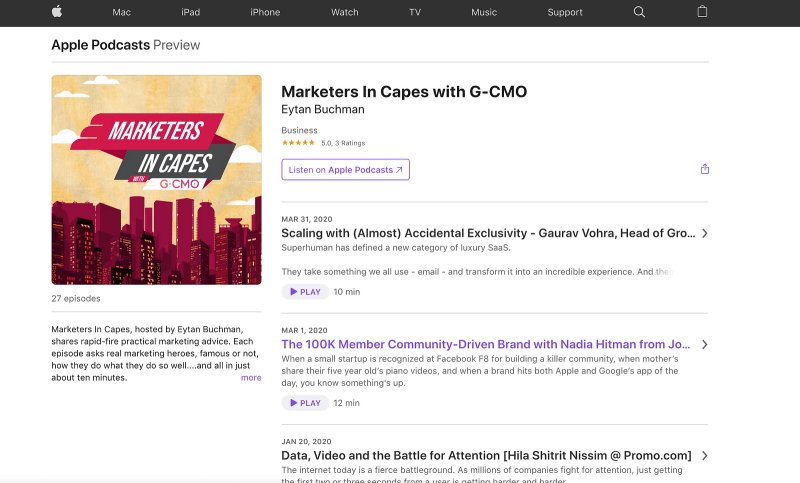

_In this post, I take a look at what I wish I knew when starting a podcast,
the technical process, some hard-learned tips around the content and format,
and some important takeaways going forward. Hope this helps you get your
podcast off the ground! This article also[appears on the Aleph.vc
blog](https://aleph.vc/lessons-in-launching-a-global-marketing-podcast-
de76f92862d0)._

* * *

If you’re reading this, you may think you’re late for the podcast party. You
are.

**But you’re not too late for the GOOD podcast party.**

There are far, far fewer people in that one.

Over the last two years, my marketing podcast, [_Marketers in
Capes_](https://www.buchman.co.il/marketers-in-capes-podcast/) _,_ has grown
into a fairly popular podcast (especially among my two to three friends and my
mother), with thousands of listeners. But it started with a puddle of tears.
More on that soon.

Twenty-two episodes in, I’ve interviewed some amazing companies, from
[Mixpanel](https://www.buchman.co.il/podcast/how-data-guided-mixpanel-to-
perfect-homepage-copy-ep-06/) to Drift,
[Superhuman](https://www.buchman.co.il/superhuman/) to
[Volvo](https://www.buchman.co.il/podcast/donuts-practically-free-super-bowl-
ads-ep-04/). I’ve partnered with [G-CMO](https://www.buchman.co.il/gcmo/),
Israel’s forum for top marketers, and some of the largest marketing companies
in the world have asked to advertise on the podcast. Every month, I get
double-digit inbound pitches.

I’m having a good time.

So I’m sharing _my_ origin story. More importantly, **I’m sharing the
recording workflow, the smack-me-in-the-face lessons I’ve learned, and some
things I know I still need to learn.**

Building a podcast is not hard. If you’re a marketer behind a brand that can
drive educational value, there are few platforms that can generate as much
concentrated and targeted exposure as podcasts.

**How it started**  
**Two things that were different at the get-go**  
**“The importance of differentiation**  
**The actual technical steps + gear**  
**Lessons Learned: what worked**  
**Lessons Learned: what still needs more work**  
**Parting recommendations**

### But it started with desperation and tears.

On February 26, 2018, _Marketers in Capes_ was born, just two and a half weeks
after the birth of my second daughter, Noga. See, for her first three months,
she wouldn’t stop crying. Except when she was strapped to someone’s chest.
Frequently mine. Thanks, Uppababy.

My core contribution to domestic sanity was strapping her on and swaying for
half the night, staring at a screen on a jerry-rigged standing desk.

And, while I love marketing [Freightos](https://www.freightos.com), there’s
only so many hours in a day you can spend working on _anything_ , even
freight.

### Enter Marketers in Capes, nèe Two Minute Marketing

Before Noga came along, I read [Walter Isaacson’s da
Vinci](https://www.theguardian.com/books/2017/dec/16/leonardo-da-vinci-the-
biography-walter-isaacson-review) bio. I wanted to take da Vinci’s
inquisitiveness, apply it to marketing, and podcast-atize it. But I had zero
patience for long-form pontification. With my time at a premium post-Noga,
this was doubly true.

**So I decided to start a marketing podcast.**

It would be short-form and heavily edited to get right to the point. And it
would explore concepts I found interesting, not the same glory stories
everyone was doing.

Sound familiar? It is. If you’re planning your own podcast, think about
differentiation. There are a lot of podcasts out there and you need to have
your own angle. Format, content, or tone — it needs to be different.

**My differentiation was chosen for me. It’s hard to interview someone with a
baby screaming in the background**. This forced a format choice, which, in
turn, shaped the podcast.

### Two and a Half Things That Made It Possible

**First, the format.** Instead of interviewing people along with a child
screaming bloody murder, I emailed them questions and asked them to record
answers at their convenience. When Noga was conked out in the baby carrier, I
recorded my editorial comments, talking in the calmest voice I could. I swear
that in some of the earlier episodes, you can hear her breathing in the
background. A little editing and bam — I was done.

See the back and
forths? Those were each recorded separately. #Revelation

**Second, to thine own self be an editor**. Being able to do your own editing
is liberating. Imagine if you could bake but couldn’t measure. Independent
editing lets you play around, helping you shape your own product. Plus, with
products like [Descript](https://www.descript.com/), literally anyone can do
it.

**Two and a half (since I only picked up on this halfway through)**. Every
episode should **tell a story.** You have 30 seconds to tell a user why they
should listen. Which means a super concise, thirty-second rendition of why
they should stick around, ideally told as a story (“over the next five
minutes, you’ll learn how X battled a marketing dragon and won the lead
princess’s heart with SEO”).

### And One Big Change I Made Along The Way

As it turned out, format was a failure as a differentiator. It helped, but it
wasn’t enough. So at some point, I sat down and wrote a short list of what
made me different:

  1. **Length** : I value listeners’ time. If it can be said in 30 seconds, don’t take five minutes.
  2. **Tone** : I like when people speak to me in human. Which means that I’ll make jokes.
  3. **Speakers** : I don’t care about seniority. I care about if the person can say something interesting. As a matter of fact, I tell interviewees that if I show the episode to a friend before publishing and it gets a bad review, I’ll trash it.
  4. **Level** : It’s hard to reach the balance between beginner content, which is more accessible, and advanced, which has a smaller audience. I decided to go with intermediate and up, which means that I kill everything (EVERYTHING) that is obvious to anyone who has been around the block.
  5. **I don’t do performance marketing**. Period.

Together, these qualities create a fairly unique show.

So having moved beyond the big “Why Are You Different Lesson” of 2019, now’s a
great time to take a knee and talk about what’s worked for me, what hasn’t, my
setup and the lessons I’ve learned along the way.

**So here goes.**

### Lessons On The Technical Side

Stop using technical hurdles as an excuse for not launching. Just stop. This
is all it takes:

  1. Find the person to interview. **This** is the hard part, not recording. Remember how many articles there were about Yuval Noah Harari after _Sapiens_? Don’t be that cliché. A unique angle almost always starts with a unique candidate to interview.
  2. Cold email the person with a solid pitch. More on that below.
  3. Use [Meetingbird](https://meetingbird.com/) to schedule a time. It saves back and forth on coordinating, ensuring that they don’t just run out of patience before you ever speak.
  4. Record with [Zencastr](https://zencastr.com/), a browser-only tool that records each person on a separate track, making post-processing way easier. When prerecording, I just ask people to use their cellphone memo app.
  5. Transcribe with [otter.ai](https://otter.ai/referrals/P6LLS0GR). This helps read through the interview, highlight interesting parts, and, most importantly, restructure it so that the interview tells a real story.
  6. Dump everything into a text editor to write my side of the interview.
  7. Record my side.
  8. Edit _very_ briefly with some basic sound cleaning and an intro/outro, all with [Screenflow](http://www.telestream.net/screenflow/overview.htm) or (much more frequently), with Descript.
  9. Upload track to [Auphonic](https://auphonic.com/) for normalizing.
  10. Upload to [Anchor](https://anchor.fm/), which makes sure it gets to Apple Podcast, Google, and…everywhere.
  11. Add links and transcription ([otter.ai](https://otter.ai/referrals/P6LLS0GR) again) on my WordPress site, [buchman.co.il](https://www.buchman.co.il/marketers-in-capes-podcast/), so I can share using only one link instead of sending Android users an Apple Podcast link.
  12. Create basic graphics using [Sketch](https://www.sketch.com/). Your podcast graphic is critical in order to stand out. Invest a little in this, or find someone on [Upwork](https://www.upwork.com/i/mobile/) to do this for you. Make sure the words are BIG — they are going to be on a small screen.

The entire process usually takes me about two to four hours per episode. The
hardest part is just finding people or brands that genuinely make me curious.
Sometimes it starts with the person. Other times, I wake up curious about a
topic and look around until I find someone who can scratch the itch.

**Which leads to yet another tip.** Become inquisitive when reading articles,
watching TV, and talking to friends. Great reporters have an ear for a story;
you need to exercise that muscle.

### On Recording…

I started this with an iPhone headset. I’ve graduated to a [$99 Blue Yeti
Nano](https://www.bluedesigns.com/products/yeti-nano/) but honestly, use a
quiet room, a normal headset, and you’re golden. **That’s it!**

[Look no further than
this mic.](https://www.amazon.com/Blue-Yeti-Premium-Recording-
Streaming/dp/B07DTTGZ7M)

When it comes to editing, the best way I’ve ever learned to edit video or
audio is by watching someone while they were doing it. Call it a five-hour
apprenticeship. It’s worth it.

### The Really Meaty Lessons

While working on _Marketers in Capes_ , I learned some things the hard way.
And because it’s ultimately just a side project, there are some things I’ve
learned and _still_ haven’t fixed. Let’s start with what does work.

### Lessons Learned: What Has Worked

  1. **Just ship it.** For the love of content, put it out there. Hit publish. Do it. Do it again. The most perfect unpublished episode is worthless compared to an imperfect published episode.
  2. **Content quality over audio quality.** Get the right interviewee or story. Very little else matters (listen to the audio quality in the “I Have A Dream” recording). In one of my favorite episodes, I [interviewed Eric Kallman](https://www.buchman.co.il/podcast/old-spice-ad-creator-eric-kallman-marketing/), the genius behind Old Spice’s “Smell Like A Man, Man” ad. We had to revert to my cellphone, complete with crappy reception. The quality was ATROCIOUS. But I’ve never gotten more positive feedback from an episode. Some people gave me a little crap for the quality, but I promise you this — they listened to every second.

  1. **Ask questions. People answer.** The best form of outbound marketing is still a personalized email that generates engagement. When I want to learn something new, I find the three best people in the world doing it, use [Clearbit](https://www.clearbit.com) to get their emails, and cold email them. I’m batting over 70% on response rates. This strategy also got me my job at Freightos. Trust me, you can ask anyone anything. You’ll be shocked by how many Fortune 500 CMOs will answer. My first interview was with [David Cancel, the CEO at Drift](https://www.buchman.co.il/podcast/carpenters-chatbots-selling-result-ep-02/). My second was with [Rand Fishkin](https://www.buchman.co.il/podcast/touch-paint-growth-hacks-rand-fishkin/), the legend from [Moz](https://moz.com/) and [SparkToro](https://sparktoro.com/). I had no previous episodes to reference and no connections — just personalized outreach. It worked.
  2. **Lower the ask.** At the same time, be super-specific and realistic. The main reason I was able to get answers is that the full investment I was going for was ten minutes or so, at the subjects’ own convenience. Be clear about what you want and remember that the cost/benefit for the interviewee is not just a function of what benefit you drive for them. For example, here’s the email I used for reaching out to David Cancel of Drift:

> _David,_

> _Huge fan of Drift (especially how you’ve built and communicate the brand)._

> _I was intrigued by the launch of the Drift Inner Circle. It exudes a
> passion for customer success, not just selling, and it’s rare for a CEO to
> be so hands-on._

> _I’m recording a podcast about it (yea, I liked it that much) and was hoping
> that you might have 60 seconds to record a quick audio soundbite about why
> you chose to launch Inner Circle and the importance you assign to helping
> customers succeed._

> _I know it’s a big ask — just want to show some of my Drift ?._

> _Eytan_

**4\. Set a high listening bar.** Be your own worst critic. I have invested
hours in an episode and then trashed it. There are mountains of crappy content
online; don’t create more. And don’t disrespect your hard-earned audience with
it. It’s a lot easier to lose fans than to gain them.

**5\. Evoke emotions.** Help your audience evolve from A to B. Don’t promise
features (Marketing insights in two minutes…). Promise a marketing evolution.
After realizing that one morning when waking up, I changed the name of the
podcast to something that I felt communicated the role of marketing
superheroes. It made a big difference.

**6\. Tell a story.** I used to try to cram as many insights as possible into
each episode. Until I remembered that people don’t consume content that way.
One of my best episodes ever, which even killed it with
[Reddit](https://www.reddit.com/) users, the most picky users in the world,
was a story of how a budget-strapped Volvo destroyed a major competitor with a
subversive social media campaign. It was a legit story, with a struggle, a
hero, a villain, and a win. Story: 1; Laundry list of tips: 0.

**7\. Persistence.** It’s not easy. With
[Superhuman](https://superhuman.com/), it took half a year of outreach to get
the interview. But I genuinely wanted to know the backstory. So I stuck with
it.

**8\. Get out of the echo chamber.** While I wouldn’t pass up the opportunity
to interview Reid Hoffman or Bill Gates, their insights are out there. The
most gratifying episodes are not the ones you’ll come across in other
podcasts. They’re stories about how to [brand a fertility
clinic](https://www.buchman.co.il/podcast/branding-with-humor-obedient/) or
[newsjack with soybeans](https://www.buchman.co.il/podcast/newsjacking-how-
soybeans-make-headlines/).

**9\. Get comfortable with the technical.** For me, as a marketer, I find
technical comfort liberating. I’m not a professional video or audio editor. I
can’t consult on technical SEO. I can’t code a (functional) product. And I
can’t create a comprehensive business model by myself. But I feel comfortable
trying and definitely know enough to be either an educated consumer or someone
who can experiment enough until I get there myself. **If you’re a marketer,
get your hands dirty. It will break the shackles.**

**10\. Put yourself out there.** Every episode I publish is scary. Partially
because sharing on my social network is still a core distribution channel, but
also because, by definition, I reach out to MY marketing heroes. Which means
that they’ll hear me making an idiot of myself — or worse — making idiots of
them. But nothing ventured, nothing gained.

### Lessons I (Still) Need to Learn

So yeah, twenty-some odd episodes in, I’m feeling pretty good about this. My
daughter isn’t crying herself to sleep anymore and, while I’m busy, _Marketers
in Capes_ is still a great escape. And there’s still more to learn.

  1. **Cadence**. I still publish the episodes on a random schedule. I know that the lag lowers my user base. It’s hard to build up excitement when you’re waiting for a month between each episode.
  2. **Effective cross-platform distribution**. My core distribution channels are personal social media accounts, the email list I’ve built up for this (low four digits), my partnership with [G-CMO](https://www.linkedin.com/company/g-cmo/), and the person I’m interviewing. Since this is a low-time investment, I haven’t done enough about pulling together the right creatives for each channel. And content without distribution is barely worth the bits it’s recorded on.
  3. **Reviews.** I haven’t cracked the code on how to get more reviews, which I’m sure is keeping me low on most podcast platforms. I’ve tried begging, but that only got the knees of my pants dirty.
  4. **Defined target audience.** This is probably the most glaring weakness. It’s hard for me to nail down exactly who my target audience is. I’m mostly inspired by Tim Urban ([ _Wait But Why_](https://waitbutwhy.com/)), who says that he writes as if he’s [talking to a stadium full of himself](https://tim.blog/2018/02/03/the-tim-ferriss-show-transcripts-tim-urban/). I record my podcasts as if I’m trying to talk to myself. This is either a huge advantage or huge weakness. Time will tell.
  5. **Flow**. One of the biggest drawbacks of my recording method is that sometimes the flow for an asynchronous interview just doesn’t work. Recently, I’ve been conducting real interviews and then chopping them up using the same editing process.

[3 reviews? WTF. Help
me fix it.](https://podcasts.apple.com/us/podcast/marketers-in-capes-with-g-
cmo/id1353391360)

### Just to wrap this up…

As a content and messaging delivery channel, podcasts can be an incredible
differentiator.

But only if you have something different to say.

Of course, if you’re approaching this for your business, follow the same rules
you would follow for any content:

  1. Do you have something unique to say? The world does not need yet another derivative podcast in your space.
  2. Do you have a unique angle?
  3. Hardware isn’t a real impediment; time is. Do you have the time and bandwidth to invest in maintaining a podcast?
  4. What distribution channels do you have?
  5. Catalog the existing relationships that you have for interviews. Who can you tap in order to drive fresh insights?

Got it?

Now go listen to [Marketers in Capes](https://www.buchman.co.il/marketers-in-
capes-podcast/).

