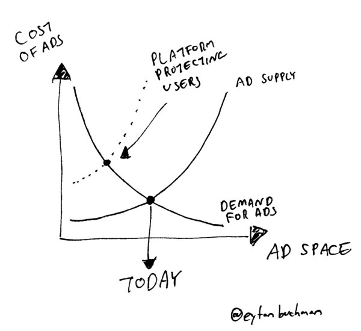
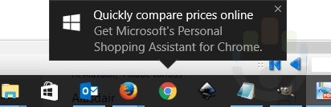

## Life is hard for digital marketers

Like everyone, I’m overwhelmed by the amount of information online.

I’m not talking only ads. There are dozens of newsletters and hundreds of
sites I want to read but can’t. **The bar to infiltrate daily workflows is
really, really high**. Getting into my routine is a zero-sum game that comes
at the expense of another channel.

Which sucks for marketers. Information proliferation has made getting
qualified attention a Herculean test for digital marketers. Why?

### Because it’s hard to buy attention.

[Paid
attention](http://www.hbs.edu/faculty/Publication%20Files/14-055_2ef21e7e-7529-4864-b0f0-c64e4169e17f.pdf)
is getting more expensive with diminishing returns. eCPM costs at the Super
Bowl soared 9X, from $19 in 1990 to $163 in 2013. In 2016, for the first time
ever, US digital ad spend [exceeded](https://www.emarketer.com/Article/US-
Digital-Ad-Spending-Surpass-TV-this-Year/1014469) TV ad spend but
[CPC](https://www.hochmanconsultants.com/cost-of-ppc-advertising/) costs are
growing too. In a digital advertising arms race, more impressions are leading
to diminishing returns. **Spend more, get less.**

### And it’s hard to earn attention

Earned attention requires sticking out in a saturated environment, a fact that
ushered in the Clickbait Generation. Even with stellar content, limited
attention means it’s hard to break out. Take aggregators.
[Mattermark](https://mattermark.com/newsletters/), [Launch
Ticker](https://www.launchticker.com/) and [Term
Sheet](http://fortune.com/tag/term-sheet/) are all incredible…but even pure
gold, 100% free newsletters don’t get read everyday. So how can other content
compete?

## Why is digital marketing so hard today?

  1. **We compete with great content**. The limited time that people do have, they spend on channels they already like. Discovery takes effort.
  2. **We compete with crappy content**. Click-bait content proliferation means display ad saturation dynamics in the content arena. As a result, it’s harder to be found even when people _are_ in discovery mode.
  3. **Creating is hard**. Great content requires time, money and creativity. And if you’re creating top-of-funnel content, costs accrue further for down-funnel content.
  4. **Even great distribution isn’t foolproof**. Snapchat may have made it big from the [New York Times](http://www.nytimes.com/2013/02/09/technology/snapchat-a-growing-app-lets-you-see-it-then-you-dont.html) sexting article but many startups can attest to a TechCrunch article that didn’t deliver. I know I can.
  5. **Promotional Blindness** – Display ads (can) suck. Look at media kits. A 0.08% CTR isn’t particularly rare. For every 1,200 readers, ONE person might click. Probably by mistake.

A Techcrunch publication does not solve everything. Via
[Freightos](https://www.freightos.com/).

## Why It’s Going To Get Harder

### Advertisement inventory on platforms will shrink

Platform operators guard their domains ferociously, providing exposure by
their own rules. If they don’t put up barriers, they die ( _cough Twitter_ ).
Sites that police better, like Facebook, survive. So the barriers go up to:

  1. Ensure ads are relevant, penalizing poor quality with higher costs (or not letting them on the platform in the first place).
  2. Reduce ad real estate to balance a good user experience with maximum profitability. Likely one reason why Google cut the number of[ads in search results from 6 to 4](https://searchenginewatch.com/2016/02/23/google-kills-right-hand-side-ads-what-does-this-mean-for-sem/) in 2016.

Ad space and cost is a classic supply/demand matrix. When platforms
artificially limit ad space for improved user experience, ad costs rise. In
September 2016, Facebook [sold
out](http://www.recode.net/2016/11/2/13503876/facebook-revenue-growth-problem-
earnings-q3) its entire ad inventory, likely signaling that its barriers will
start to go higher.

### 

### There’s less physical screen space

Cellphone and laptop screens have limited real-estate. Even iPhone screens,
which were steadily growing, have plateaued. On a software level, operating
systems like iOS and Android create very specific style guides to encourage
drawing within the lines. Violators exist but large platforms rely on
Darwinian app evolution to weed out violators of invasive design.

Marketers evolve, shifting from webpages to bookmarks and then to extensions.
Then they look for new places, like the menu bar (ala Cortana’s invasive
updates) and notifications. And when new screen real-estate opens, (like new
tab windows apps) marketers jump. Sure enough, this creates another zero-sum
race to the top of the hill.

Cortana’s annoying advertisments. Via
[MyPowerUser](https://mspoweruser.com/microsoft-now-promoting-one-chrome-
extensions-windows-10/)

### Augmented reality and audio interfaces

Screens are so 2016. Augmented reality and audio interfaces both aim to reduce
sensory input, offering relevant and contextual information.

But they both have the potential to be incredibly invasive; they’re literally
everywhere. Amazon worked hard to get Alexa in over 5 million homes and will
not give in to low-quality content. The platform will remain king, ad and
content filtering will remain kingmaker and there will _always_ be advertisers
willing to spend more money to play by the rules, pricing out cheaper access.

This is true for earned exposure as well. To make it into people’s ears or
virtual realities, only the best of the best will make it past reader’s
filters and the platform filters.

## What it means

Together, this paints a picture of higher barriers for marketers:

  1. Platforms will continue to reduce ad space
  2. There’s less physical space for ads
  3. New mediums will have less tolerance for generic, low-quality content.

Great product/market fit, hyper-targeted marketing and exceptional
understanding of target audiences was key for digital marketing until now.
With limited attention and space, it’s only getting more important.

