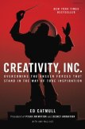

The recipe for the internet is 99.9% crap, 0.1% creative inspiration.
Unfortunately, like most digital marketers, I’ve played my fair role in
creating crap.

But hiding under the mountains of terrible articles are
[incredible](http://web.archive.org/web/20080213082423/http://www.marginalia.org/dfw_kenyon_commencement.html),
[mind-blowing](https://penusa.org/sites/default/files/didion.pdf)
[pieces](http://www.gregoryciotti.com/ogilvy-last-will/). Articles that
trigger a sense of longing before you even reach the end. Videos you [can’t
stop watching](https://www.youtube.com/watch?v=ZUG9qYTJMsI). Social posts you
_actually_ like.

But the gems are streamrollered by the sheer quantities of junk.

## The Path To Great Ideas.

Truly incredible ideas, which are a combination of perseverance and
creativity, shine with a brilliant elegance.

Hard work is easy to understand (but harder to actually do). But while
creativity sounds elusive, it actually _is_ a science.

Neuroscience has [three](https://blogs.scientificamerican.com/beautiful-
minds/the-real-neuroscience-of-creativity/) pretty clear models for how
creativity works, each relies on different networks in the brain:

  1. **The “Shut up and Focus” Executive Attention Network:** Meticulous, laser focus to relentlessly assault a specific problem.
  2. **The “Imagine if…” Default Network:** Great at conceptualizing alternative perspectives, recalling events, contemplating the future and considering other people’s viewpoints.
  3. **The “Watch and Connect” Salience Network:** Built for ongoing monitoring of the outside world and your internal consciousness to creatively problem-solve.

Interestingly enough, most creativity advice I came across very clearly tap
into these three networks.

## Sparking Creativity In The Real World.

One great start is creating an environment conducive for creativity.

Ed Catmull, a Pixar co-founder, discusses how the legendary storytelling
company does just that in Creativity, Inc. [The
book](https://www.amazon.com/Creativity-Inc-Overcoming-Unseen-
Inspiration/dp/0812993012) is geared towards creating the right culture but
it’s easy to distill into personal habits.

  1. **Broaden your horizons.** Catmull recommends hiring people smarter than you. If you’re looking to get creative alone, focus on broadening your personal exposure to learn more.
  2. **Stay open.** Whether on a team or alone, don’t have an itchy trigger finger when spitballing ideas.
  3. **Stay open for a while**. Good ideas aren’t accompanied by a heavenly score or a lightbuld. Some need to be coaxed and cultivated, dragged out, explored and shaped until you find the right match.
  4. **Share.** No matter what you’re working on – a blog post, a startup or a book – bounce the idea off people. More eyeballs means more insight.
  5. **Embrace constraints.** Even artificial limitations can make you look at things differently.
  6. **Recognize that failure is necessary.** You’re going to fail. Catmull says good managers aren’t there to help succeed; they’re there to protect failure. In his words:

> In order for greatness to emerge, there must be phases of not-so-greatness.
> Protect the future, not the past.

## There Are A Million Roads To Creativity

It can get even more tactical though.

Brian Eno, the music maestro who produced Bowie, U2, Talking Heads and others,
promotes studio creativity with [Oblique
Strategies](http://www.npr.org/sections/money/2016/11/18/502475485/episode-736-messy-
nobel) – basically a deck of cards with cryptic constraints.

But that’s military-grade.

So I went searching for _real_ methods, used by _real_ people. And no better
way to do that then asking great creators – the kind who consistently come up
with brilliantly simple ideas – how they do it.

## 4 1/2 Other Creative Strategies From Real Creators

### Creativity Hunt. Everywhere.

[Ryan Hoover](http://ryanhoover.me), the emoji’ed enchanter behind [Product
Hunt](http://producthunt.com) (????meow), says it’s all about observing.

> My inspiration largely came from my conversations with people and
> observations of my own behavior. When you see or hear something interesting,
> consider writing it down.

Inspiration is out there for the taking…if you’re ready to reach out. It
sounds so simple. But getting into the habit of keeping your eyes open and
actually calling out patterns is incredibly challenging.

###

### Get Lost.

But what about the professional writers? [Joanne
Weibe](http://www.copyhackers.com), the brains (and pen) behind Copyhackers
naturally answered my question with prose so pretty that I didn’t want to
touch it:

> Well I’ve found that creativity is a shy, polite little thing, so if you
> want it to talk, you need to stop talking. I come up with the best ideas for
> everything when I get away from all sorts of noise and my ability to create
> noise. If you can temporarily abandon your team and your desk – whether by
> going for a walk or running on the treadmill or showering or hopping on the
> bus and staring out the window – that’s great for shutting up the world,
> zipping your lips and letting your creative little mind spill everything
> it’s been dying to say.

### Or First Get Found And Then Get Lost.

[Roy Munin](https://twitter.com/muninjlm), who clawed together the Jerusalem
startup community, prescribes relentless immersion, studying best-of-breed-
examples, attending meetups and talking to pros. He then lets it percolate by
aggressively chilling out with Netflix, video games or jogging.

> Your mind makes connections and creates new things all the time when it’s
> bored. You just have to feed it with the best materials to play with.

### Spatter?

[Aaron Friedman](http://digitalhighrise.com/about-aaron-friedman) is the
Director of Innovation at [Five Blocks](http://www.fiveblocks.com/), a good
friend and rocks at packing ten tons of creativity and personality into short
blog posts. His strategy is just to run simultaneously in a million directions
and bank on it all coming together:

> My mind is literally splatter paint on 10 different canvases at the same
> time. I am just fortunate enough that I can let my ADD run wild and it ends
> up coming back with something half decent.

## Feel The Walls Closing In?

Relax.

These are strategies, not a checklist. Everyone works magic their own way.
[Jay Baer](http://www.jaybaer.com/about-jay/), one the most creative writers
in content marketing, told me he just rolls with it:

> Personally, I just think about what I see and hear when talking to clients,
> and go with that!”

I heard that same response again and again.

Button up, Bilbo. There’s no fast track to creativity. It’s a long journey,
with hard work, observations, solitude, contemplation and, yes, spattering.
But it is not an intangible. My personal takeaways?

  1. > Open your eyes – there’s inspiration out there. Watch, listen, observe.

  2. > Keep notes. Train yourself to not just observe but to realize when you’ve observed something note-worthy.

  3. > Talk to friends, talk to enemies, talk to your pizza guy.

  4. > If you’re stuck, throw in some artificial constraints on your problem.

  5. > Still stuck? Pull an Elsa and Let It Go for a bit.

Now go ye forth and create.

