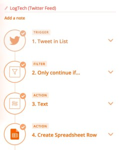
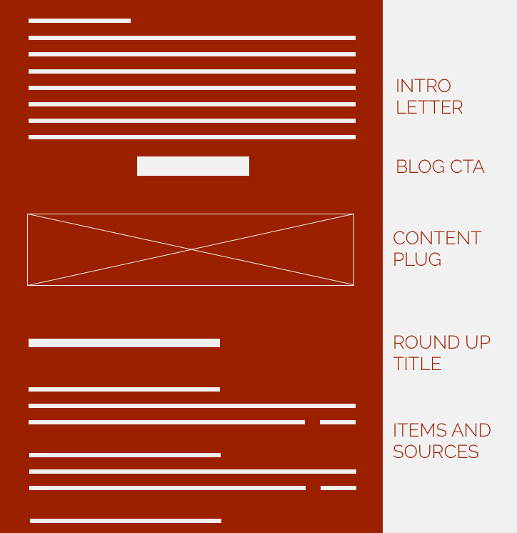

**The I’m-too-busy-to-read-this overview:**

  * Newsletters that provide value are damn helpful
  * You can automatically curate them by combining Twitter lists, internal Slack channels, and some clever Zapier kung-fu (I walk though this process below)
  * My personal favorite newsletter metrics to track are user interactions for prospect segmentation and opens/sends

[Facebook turning off the tap for
publishers](https://techcrunch.com/2018/01/28/how-publishers-will-survive-
facebooks-newsfeed-change/) proved why owned direct access is critical. For
marketers, that means that emails are damn important. But an email is nothing
with a good excuse to ping a user base. Which is why a brilliant newsletter is
a gold-mine for:

  1. Staying top-of-mind during sales cycles
  2. Getting organic forwards from your readers
  3. Segmenting prospects based on content engagement (my favorite part)

With those goals in mind, I managed to build a sector-specific B2B newsletter
with a super-targeted five-digit distribution list that **regularly hits a
30%+ open rate**.

The best part? The automated process takes **less than two hours of work a
month** – one day of work a year for 40,000+ impressions from top notch
prospects.

Here how I do it.

## Step 1: Discover Your Niche.

Start by **defining your newsletter’s goal** , whether it’s nurturing
prospects towards a sales-ready state, brand visibility, or anything else.

Then **decide who you’re targeting**. More parsimonious audience selection
means less time in Promotion Tab land and more time cha-cha’ing to email
Shangri La.

Last step? **Find what they’re missing in their life**. Groove’s [Journey to
100K](https://www.groovehq.com/blog/100k) hit entrepreneurs up with updates on
building a business. Product Hunt kills it with a [daily digest of new
products](https://www.producthunt.com/newsletter). And the specific type of
content you choose will dictate the **frequency**.

For example, I was going for tech decision makers at logistics companies.

If you think that sounds boring, you’re absolutely right. So I decided to make
them feel like the coolest thing since the internal combustion engine by
showcasing truly awesome tech developments in their field:

  * **Audience** : Technology decision makers at logistics companies
  * **Goal** : Ongoing awareness with nudges down the sales funnel
  * **Niche** : Showcase logistics technology
  * **Frequency** : Monthly

Time for content curation.

## Step 2: Curate the hell out of it. Automatically.

Gartner consultants get paid to report on market trends. Marketers don’t.

To make this cost effective, I needed a way to automatically compile the best
updates. The good news is that people inside my company and outside of it were
already curating industry news for my newsletter…and they didn’t even know it.

[Enter my love affair with Zapier](https://www.buchman.co.il/how-to-build-a-
die-hard-user-base/).

### Tapping into my company’s fount of knowledge.

Like many companies on Slack, we have two channels where industry news tends
to surface: a competition channel ( _#competition_ ) and an industry news
channel ( _#logtech-updates_ ). Both are essentially crowdsourced news
aggregators compiled by the best in the business – my colleagues. I just
needed to make these Slacks easily parsable at the end of the month, when I
compile the newsletter.

#### **The Zapier Magic:**

  1. A new Slack message is posted in our #competition or #logtech-updates channels.
  2. Filter by Zapier ensures that only messages with non-Freightos links continue in the flow.
  3. Zapier Formatter isolates the URL posted from the Slack channel.
  4. Store link, message content and date in my newsletter Google Spreadsheet

### 

### External Curation

It only took a few months in the sector to identify Twitter movers who
regularly share awesome content. I added them into a private Twitter list (the
best way to consume Twitter IMO) and use Zapier to easily store them in my
Google newsletter spreadsheet.

#### **The Zapier Magic:**

  1. A new Tweet is made in a Twitter list
  2. Filter by Zapier ensures that a URL exists and that the Tweet is a not a retweet
  3. Formatter by Zapier isolates the URL tweeted
  4. A new row is created in Google Sheets with the Tweet URL, the user that tweeted it, likes, retweets, and the description

I should mention that I tried to use [Hootsuite](http://hootsuite.com) to
curate the list but scrolling through a month’s worth of tweets is just
totally unscalable.

### The Media

While 95% of the newsletter content comes from automated sources, I do run a
quick monthly _site:www.domain.com_ search, filtered by last month results, on
TechCrunch, Verge, Wired, and Mashable with key terms to make sure I’m not
missing out on anything big.

This _could_ be automated…but I’m a firm believer in only automating things
that will save time and found that there’s still too much guesswork in this
process.

XKCD’s take on what to automate

I’m left with a spreadsheet of URLs, descriptions, dates, and Twitter
engagement details, based on my Twitter list’s tweets, internal Slack
messages, and interesting media reads. All that’s left for me to do is ro
cherry-pick the 15-20 items that really pop out from the list of 300, leaving
me with:

  * A source domain, stripped of path mess (ie techcrunch.com)
  * A source URL
  * A description

Time to start writing.

## Step 3: Editorialize.

At this point, I’ve probably spent about ten minutes curating content for this
month’s newsletter. But Mama Buchman didn’t raise no lazy writer…so I open
every article I want to share and summarize it in a 20-25 word description,
together with an interesting title.

After about twenty minutes, I have the best industry news curated and ready to
go. Which means it’s time to editorialize.

I’ve learned that people don’t want _just_ updates – they need an authentic,
human voice. Each newsletter kicks off with an observation that’s about
150-200 words . It can be based off of a movie I recently saw, an article I
read, or a random Google search…but it needs to plug into the newsletter’s
general theme.

Remember, to drive ROI, readers need to eventually head back to your website.
So after the lead insight, I push readers to a long-form blog post on our
site, followed by the monthly industry roundup we curated above. The lead post
usually garners about 12%-15% of clicks, which is just fine with me.

Since the end result is an incredibly informative newsletter (if I do say so
myself), I’ll occasionally sprinkle in shout-outs for historical content or
free tools we’ve created, positioned as ads between sections of the
newsletter. No matter what, **every single piece of content should still
provide value**.

Wireframe of the roundup newsletter

## Step 4: Prune and segment based on engagement.

### Metrics to ensure awesomeness

Be hard on yourself. If your open rate isn’t there, you’re either building
your list with a bait-and-switch or not providing outstanding content. To make
sure I’m on track, I track open rates and click-through rates (duh), I also
like to track the number of unique email opens. Great, informative emails have
a tendency of being forwarded; I like to shoot for an average of two opens per
recipient, a good sign that your email is getting forwarded.

### Gather insights

By tracking regular reading behavior, you gain superhero level insights into
what your users want. If you have VIP users that click through to articles on
what specific competitors are up to, that’s priceless information for your
sales team. See someone clicking on product updates, also priceless. In my
last month email, I saw a VP of R&D at a top logistics company click through
on a link about what their competitor was doing with another startup. That’s
solid gold where I come from.

### Bonsai tree it.

Bonsai trees can regularly be trimmed by up to 10%. So can your email list.
Axe people who don’t open emails. I like to send out emails asking unengaged
users people if they want to unsubscribe – there’s no reason to have them
hanging around the entrance to the party if they’re not going to come in.

### Tap into the superstars.

My favorite aspect of forging a relationship with readers is that every once
in a while, you build up credit in the permission-marketing bank for an ask.
For me, that comes in one of two shapes:

  1. **Contribute content:** I love to ask for people to participate in surveys, which we then repurpose into content. Which then brings in more emails. Which creates a god-like content-marketing loop.
  2. **Push the Product:** Don’t be afraid, when the time is right, to pop the question. Whether it’s in a PS, a targeted email to segmented, buy-intent users, or a genuinely interesting new product release, you gotta try every once in a while to push people down the funnel.

Enjoy!

