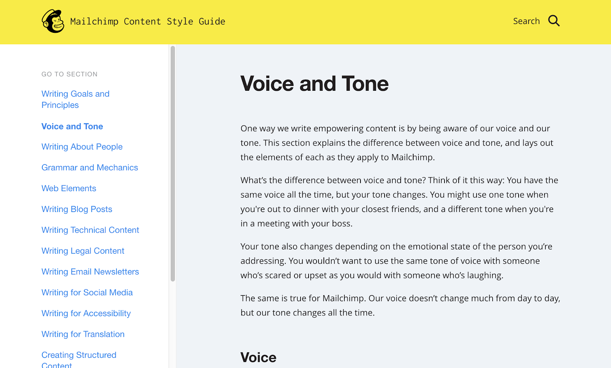

_(This article originally appeared on Aleph.vc’s Medium
blogroll[here](https://aleph.vc/seven-startup-branding-lessons-learned-the-
very-hard-way-71e475420f22).)_

* * *

Six and a half years ago, I got called out on my branding ignorance.

I deserved it.

I was interviewing for the first marketing role at
[Freightos](https://www.freightos.com/), sitting on Zvi Schreiber’s back
porch, when he looked up from my resume and asked:

> “What kind of branding experience have you actually had?”

He was right to ask.

My “branding” experience at that point had been a few talking points as a
spokesperson and choosing some color palettes for a friend’s website. But
there it was on my resume anyway:

> Conducted full-cycle website design, from identifying needs, to branding
> design and programming.

I owned up that I didn’t really have experience (if that wasn’t obvious from
the combination of “branding design” in one word) and miraculously got the job
anyway. And then I learned. Fast.

# Because for a startup, few things are more important than brand.

A brand opens doors. It buys a brief pause in a busy LinkedIn feed scroll. It
lubricates rusty funnels, drives media headlines, and buys word-of-mouth
growth money can’t buy.

At Freightos, we’ve built a [strong brand](https://www.freightos.com/in-the-
news/) within the logistics tech space. And we’ve put it to the test with
[corporate acquisitions](https://techcrunch.com/2016/08/31/online-freight-
marketplace-freightos-acquires-spains-webcargonet/), teetering Jenga towers of
layered corporate and product lines, and a big rebrand.

Through it all, our branded search remains strong and our name can, and does,
get us meetings with Fortune 500 companies.

Since that interview on Zvi’s porch, I’ve been on a mission to fill that gap
between my resume and reality. In the process, I’ve made some serious
mistakes. This article condenses the lessons I’ve learned into 1,500 words to
save you the trouble of repeating them.

Most of my missteps — and successes — were experienced with my brander-in-
arms, [Guy Laor](https://www.linkedin.com/in/guy-
laor-b6015210?originalSubdomain=il), Freightos’ VP Design & UX, who typically
was responsible for picking up the pieces after I made the mistakes.

But before I dive in, some brutal honesty. The resolution to many — if not all
— of the mistakes below are still in process.

It’s hard to identify brand mistakes and even harder to resolve them. But if
you take away one thing, it’s this:

> A brand needs to be actively defined, distributed, and evolving. If you’re
> not sharpening your brand implementation, I guarantee it’s already starting
> to fade.

# 1\. The Blank Slate Lesson

Once upon a time, Freightos was briefly FreightOS (Freight Operating System —
get it?). But we learned that we couldn’t trademark that name because it was
“descriptive.” So Freightos it was.

**Six years later, people still talk to me about FreightOS.**

And once you’re (literally) branded, it’s hard to shake it off. So if you’ve
chosen something, think carefully before changing it. Which is where our
mistake went down.

When we changed the name, we updated our marketing assets, our website, and
let our entire company know.

But we left loose ends.

Just as an example, one investor was updated but didn’t fully communicate it
internally within their organization. So those capital “OS”s snuck their way
into intros to new clients, updates to LPs, and more. The only way we
eventually managed to extinguish it, or at least beat it back to a low simmer,
was by aggressively jumping on every misspelling with a correction and then
convincing our entire team to do the same.

**The Lesson:** You only have a blank slate once. Make sure you’re pitch
perfect or you’ll be dealing with the echos forever.

# 2\. A Brand is About a Story, Not a Logo.

Freightos is a complicated company.

We provide software for logistics companies, airlines and Fortune 500
retailers, offer data insights to financial organizations, and run an online
freight marketplace for importers.

With more customers and employees comes less control. Inevitably, a feature is
released without the right graphics. A sales deck goes out without the updated
cover slide. A logo gets resized and squashed.

**The solution is a good, unifying story.**

We lacked the glue of one story. It showed. So when we rebranded in 2015, our
mission became finding one story that brought it all together.

Designing an awesome logo and visual identity is hard, but it involves a
different skill set than fleshing out a story. So we tapped two separate
companies for the rebranding: one to help with the story and the other to work
on the visual language.

After speaking with customers, prospects, investors, and most of the company
employees, we identified our mission: to make global trade frictionless by
bringing freight online. It worked.

Our mission slide, which graces almost every presentation I get my hands on.

When a story resonates, it takes on a life of its own. People who interact
with the brand start to see everything within that context, filling in the
blanks even if one slide is off-brand.

**Lesson Learned:** Uber changed its logo and style. Coca Cola changes its
tagline [every two and a half years](https://adage.com/article/news/coke-
taglines/302205). But the story remains the same. Find the right people who
get storytelling, lock the story down, and communicate the heck out of it.

# 3\. Branding Rollouts. Internally.

At [WebCargo](http://webcargo.co/) by Freightos (more on that later), we have
a variety of different products for different customers. So we created a suite
of individual products with separate names: WebCargo Air, WebCargo Sky, and
WebCargo Horizon.

An internal draft of our complicated product ecosystem

It was complicated but necessary. And then we forgot to tell everyone.

So at the largest air freight trade show, a Freightos executive was asked
about a specific product by one of the world’s largest airlines. And our exec
didn’t even know the product name.

# ?‍♂

**It wasn’t his fault.**

We had spent dozens of hours fleshing out the product ecosystem, name, and
features. We wrote a presentation, and circulated it ad nauseam for feedback.
Then, for some reason, we just shared it and forgot about it.

The best branding is barely worth the pixels on which it’s briefly presented
without internal amplification. Whether it’s time, money, or both, **make sure
you invest as much in internal education as you do in creation**.

**Lesson Learned:** If a product name falls in a forest and no one is around
to hear it…Creating a brand is only half the battle; implementing is harder.
And no one can build (or erode) a brand better than your employees.

# 4\. How We Decided to Pull Off the Big Split.

When your company services multiple audiences, the story isn’t always the
same. Amazon may be the Everything Store but then what’s Zappos? Or The Book
Depository? Amazon knows that when a strong brand has a unique appeal to a
specific base, it deserves its own life.

So it keeps those brands alive.

In Freightos’s case, one of our business lines — Freightos.com — occasionally
alienated customers of another — [WebCargo](http://webcargo.co). So despite
having a strong corporate brand, we decided to split off the brands.

There’s far more clarity when Freightos.com makes global freight frictionless
for importers and exporters and WebCargo digitizes freight sales for logistics
providers and carriers. Different audiences, different products, different
brand.

Of course, both are united by the same story of frictionless global trade.

**Lesson Learned:** A strong brand for one target audience can be an Achilles
heel for another. As hard as it is to split brand equity, sometimes it’s a
necessary plunge that can provide clarity to users and employees.

# 5\. Sticking to Your Brand Guns.

This one is a mistake we came very close to making, all for the chance to get
a juicy mention in The Wall Street Journal.

Once you establish a house of corporate, business, and product brands, police
the heck out of it. Because if you aren’t consistent about how you communicate
your brand, it won’t last.

Once the WebCargo and Freightos split was decided upon, it took sometimes-
Herculean efforts to maintain it, even internally.

We got stuck in an epic 10-email train wreck with an editor from The Wall
Street Journal who was interested in a data point we shared, but was confused
by the range of products across our brands.

By the time we clarified that WebCargo wasn’t a marketplace, he had spiked the
mention.

Sure, we could have let it slide when he reached out and just let him call
WebCargo a marketplace. But the goal is to **get the right message to the
right audience, not just to get your name in the paper**. The mixed brands
would have been confusing to the people that mattered. And that’s all that
really mattered.

**Lesson Learned:** Once you have your brand structure defined, stick to it.
Create internal rules about what to attribute to corporate or business brands
and then communicate it as clearly as you can. If you need to, take advantage
of separate websites, email signatures, email domains, and logos to help drive
the point home.

# 6\. Descriptive Product Names Are Okay Too.

Remember the poor executive who just didn’t know our new product name?

A big part of (justified) employee confusion stems from having too sprawling
of a product ecosystem. When employees don’t fully understand the big picture
product landscape, you can bet the farm that prospects don’t either.

So, belatedly, I discovered the beauty of using descriptive product names.

If our flagship product is “Freightos Marketplace,” our enterprise solution
can simply be “Freightos Enterprise,” not “Freightos Supercharge.” And, of
course, you can try to avoid this by simply folding one product into another
(when it makes sense, of course).

**Lesson Learned:** Witty copywriting is fun for copywriters but typically
doesn’t sell well. “Get ship done” may sound great on a signup button but gets
destroyed on our site against a more practical “Compare rates now.” Sometimes
calling a spade a spade or an online freight marketplace an online freight
marketplace works.

# 7\. Mission Statements Are Awkward.

If you asked a Google employee what they do and they responded “ _I organize
the world’s information_ ” (Google’s mission statement), you’d probably give
them an awkward stare, nod, and sidle away.

Translating your brand — especially a complex one — from design assets into
execution requires more. Our marketing team has spent a lot of time distilling
our corporate voice into a few guidelines. But we’ve been historically lax
about turning that into something usable.

When you read copy written from non-marketers at Freightos, it shows. Because
if we want them to write like us, we need to show them how.

Give your entire team access to the clear and concrete guides on the brand
story, tone, and guidelines to make sure that they can implement them.
Mailchimp [literally wrote the book on
this](https://styleguide.mailchimp.com/); every employee gets trained on how
their chimpanzee communicates.

At the very least, a good style guide should include:

  * **Values:** What are the main values that the company tries to communicate? Are they irreverence (Cards Against Humanity), dependability (Fidelity), pragmatism and fun (Dollar Shave Club)? Define the core personality of the brand.
  * **Voice and tone:** How do those values translate into the written and spoken word? Does the brand tell jokes? Get to the point? Stay very crisp? What concrete qualities do you aggressively communicate?
  * **Implementation:** Get specific on actual writing style. How does the logo and brand name appear? Do you use emojis? What about GIFs? What gets capitalized and what doesn’t? Do you use industry acronyms? Do you start a conversation with “What’s up,” “hey,” or “Hello, sir?” The more specific, the easier it will be to train and enforce.

Style guides don’t need to be pages long. Their purpose is to help people
implement the brand without needing to run to their Friendly Neighborhood
Marketer.

**Lesson Learned:** Create a style guide. If it’s not clear how to take the
guidelines and implement them in a sales email to a customer or a support
chat, keep on editing it.

# Brand Matters. Even for ROI-Centric Marketers.

I didn’t get it sitting on Zvi’s porch, but I sure do see it now.

Brand has the power to differentiate a commodity (bottled water!), unseat
Fortune 100 companies (Dollar Shave Club vs. Gillette), and literally own
eyeballs (Warby Parker). And it’s measurable, whether you’re looking at
branded search terms, social media mentions, or the invitations to suddenly
speak at trade shows you used to pay five-figures to attend.

Brands don’t need to be mysterious or the purview of mustachioed hipsters
sipping cauliflower espressos at a bar.

**Treat your brand right. Pay attention to your brand — how you train others
to implement it, the tools you give them, and how you enforce it — and it will
treat you right.**

