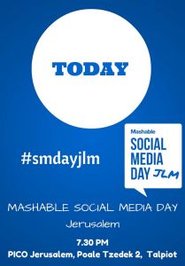

Thanks for popping by! You can check out my main points from tonight’s
Mashable Jerusalem event here. Got comments? Well, if you were listening, you
know what to do.  

## The biggest trend in online marketing is…

**Context.**

The inbound/outbound marketing dichotomy is going…going…going…gone. Until now,
prospects were either looking or being found. Today, social media streams,
together with wearables, mobile/tablet devices and, most importantly, context-
dependent delivery mechanisms, means that **context-dependent marketing is
becoming more accessible to marketers**.

As marketers, our challenge is (after we develop our strategic messaging and
demographic) to hunt for the perfect medium to get to that demographic. A
popup ad on my watch for a taxi is going to be way more powerful if it hit’s
me when I’m vacationing in another city, have been walking for ten miles and
have a date at a hotel in thirty minutes.  
Because marketing needs to be [instant
(R/GA)](http://www.adweek.com/news/advertising-branding/slide-launched-
thousand-arguments-cannes-158630).  
_Translated into actions: Focus on actionable, bite-sized and context
dependent content marketing. Yea, social media is born for this._

[Tweet “Inbound/outbound marketing is out, context-dependent marketing is
in.”]

## My greatest marketing success was….

Getting retweeted by Cap’n Crunch

> From one military captain to another,
> [@RealCapnCrunch](https://twitter.com/RealCapnCrunch) , I stand by you and
> the S.S. Guppy.
>
> — Eytan Buchman (@EytanBuchman) [June 20,
> 2013](https://twitter.com/EytanBuchman/statuses/347651826860060672)

  
If I had to choose something else, it would probably be:

  1. Getting a boring freight B2B company in both [Techcrunch ](techcrunch.com/2014/03/25/freightos/)and [Bloomberg](bloomberg.com/news/2014-06-19/digital-shipping-platforms-cutting-684-million-errors.html) within three months (and about 10 trade publications). _How I did it: Use “targeted strikes” – find the exact right person to get to online, research them, engage them and benefit. By the way, check out[twtrland.com](My%20greatest marketing success was....) to see how easy this is. _
  2. Getting feet in the door to some of the biggest freight companies out there. _How I did it: Well, our sales team did it. But the key to get in was personalized research we did about their specific company, showing them that they had a problem. Once they saw that, it resonated enough to provide some real value._

[Tweet “Social media is all about targeting. Don’t tweet to everyone. Tweet to
someone.”]

## My Top Five Apps

  1. ~~YO~~
  2. Chrome: Duh. It does everything. And it syncs.
  3. Drive/Dropbox. I file everything. This is a godsend if you’re OCD.
  4. IFTTT: Automate your life. Takes some setting up…but worthwhile when you hit a good recipe.
  5. WordPress: Mostly to see if content takes off…and then to tailor the CTA to something more time-specific.
  6. Twitter: It’s news, social interactions, humor…and I’m addicted. Please help.

## What listening tools should all marketers be using?

  1. **WHEREVER YOUR AUDIENCE IS. HELL, GET ON YO IF YOU NEED TO.**
  2. [Twtrland](twtrland.com). See above
  3. [BuzzSumo](buzzsumo.com) – helpful for trends
  4. [Bit.ly’s Realtime](rt.ly)
  5. Trade publications: Boring as hell, relevant for B2B.
  6. Google Alerts. Cause Google.

## What do I think about #Hashtags

The first internet page went up in August 1991. In August 1997, Chris Messina
used a hashtag for the first time on Twitter. Yep, 16 is the right age for
messy, immature things to happen.

In all seriousness, I think it’s something that will stick around. As an event
indexing tool, or a branding campaign, it can work…but it can just as easily
backfire. Online audiences are fickle and if you don’t hit the right vibe and
get a nice critical mass, expect it to fizzle pretty quick. People give into
crowds, even when they know they are wrong ( _ala_ the [Asch Experiment of
1951](http://www.simplypsychology.org/asch-conformity.html)). Basically, use
it if:

  1. You want to index something specific
  2. You believe strongly that it will take off
  3. It can’t be turned against you very easily
  4. Early adopters aren’t your target. _Cause they’ll probably abuse the s**t out of it. They do that._

Thanks. Now follow me online.

[feather_follow]

