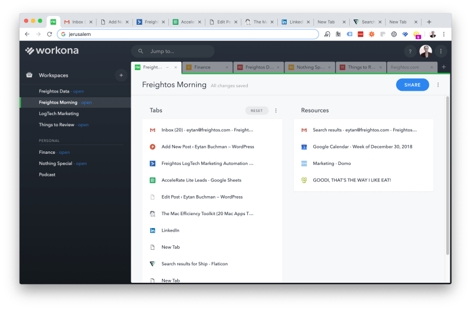

I still remember the _aha_ moment when I learned that F4 toggles between
anchoring rows and columns in Excel formulas.

And despite I the world’s worst memory, I seem to remember keyboard shortcuts,
mostly because of the carrot that they they help recover hours of my week.

So after fielding a couple of questions, here are the **twenty Mac
productivity apps** that I can’t live without. Or, _sans_ dramatics, the apps
that significantly improve the quality of my life.

I’ve split them into must-haves, nice-to-haves, and honorable mentions, but
they’re all good. And one word of warning – many are paid apps. I value my
time and every one of these has paid off…in spades. Plus, good developers
deserve to make money.

Oh, and to make _you_ more productive, here’s the whole list up-front:

## The Short List

  1. Alfred: Launcher
  2. aText: Text Expander
  3. Pastebot: Clipboard Manager
  4. Keyboard Maestro: Macro Hero
  5. Deckset 2.0: Markdown –> Presentations
  6. Ulysses: Writing
  7. Hazel: Folder/File Management
  8. Todoist: To-Do Lists
  9. Bartender: Status Bar Manager
  10. Filepane: Drag n’ Drop File Control
  11. Monosnap: Screenshots/Videos
  12. Spectacle: Window Management
  13. Amphetamine: Sessions Management
  14. DaisyDisk: File Space Recovery
  15. Muzzle: Video Privacy
  16. Workona: Toggle Browser Work Setups
  17. Fantastical 2: Calender
  18. Krisp: AI Voice Call Improvement
  19. Trello: Task Coordination
  20. Transmit 5: FTP Server

**And now for a little more depth…**

* * *

## The Must Have Mac Productivity Apps

### Alfred (Free, $30 for real value)

[Link](https://www.alfredapp.com/)

Alfred is the most important productivity tool I use on my Mac.

The high-level pitch is that it’s a launcher, where you hit a shortcut key and
start typing to instantly open applications, perform calculations, skip
Spotify songs, and more.

According to its stats, I use it over twenty times a day and I can’t help but
feel like that’s low-balling.

I mostly use it to locate folders or files, open them, perform quick math
calculations, and open URLs. But if you shell out a one-time fee of $30,
you’ll get the ability to build your own workflows or [download a boatload of
free ones](http://packal.org).

**With the free version** , you can:

  * Find any file, open it, browse folders, or cut and paste, all with inline search
  * Run quick calculations without opening up anything
  * Find correct spelling or definitions of words
  * And a million other things, including running system commands, use word snippets (ala aText below), open bookmarks, and more.

**But when you go paid…**

The real gold comes in with [Powerpack](https://www.alfredapp.com/powerpack/),
a paid add-on that lets you customize workflows or download ones that other
heroes have built like…

  * [Slack](https://github.com/yannickglt/alfred-slack): Find users or channels and send them messages anywhere
  * Custom searches (I have a predefined search where I enter a company name and it automatically searches in Google Images with transparent colors and the word logo appended).
  * Control Spotify
  * Run quick conversions between unit measurements
  * Turn off/on notifications (Do Not Disturb mode)
  * Write your own scripts (I wrote a Python script that lets me put in a name and company name, and then queries Clearbit and Hunter.io for the user’s email)
  * Connect to Zapier (with which I have a [long-standing infatuation](https://www.buchman.co.il/how-to-build-a-die-hard-user-base/)). Yea. I use this to for a million things, like adding or removing users from email lists or even logging press hits in a Google Sheet
  * Image searches
  * Universal plain-text paste
  * Trigger system macros from Keyboard Macro (more on that later).

Use this for a week. You’ll never go back.

## aText ($4.99)

[Link](http://www.trankynam.com/atext/)

This is also something I could never go back on.

It’s incredible how often we find ourselves writing the same things again and
again and again. And, like good sheep, we never question if there’s a better
way.

That’s baaaad. And it’s exactly where text expanders come in.

Over the past three years, I’ve built a huge library of emails, addresses,
links, and templates that I automate to be typed with aText when I enter a
keyword. To make my life easier, all shortcuts are triggered with a prefix of
a “;”, followed by a memorable shortcut.

Here’s an example of how it works. Instead of typing in my personal email
address 78 times a day, I type “;emp”, which automatically corrects to my
personal email address. “;emf”, on the other hand, will enter my Freightos
email.

Some of my favorite text expansion snippets are:

  * Contact details: my emails, phone numbers, and websites
  * Addresses: personal or family addresses, as well as company office addresses globally
  * Frequent links: Freightos links, my MeetingBird meeting schedule link, my Zoom meeting link, and my social platform links
  * Color palettes: Hex codes of the core Freightos or personal website colors that I use (ie “;blue” corrects to #0093EE)
  * Bios/Boilerplates: My bio, Freightos’ missions statement and more
  * Email intros: Email basics that I use again and again “;ihyaw” corrects to “I hope you are well”
  * Dates: I use 20190114 as a convention for appending file names. Typing shortcuts can automatically populates current dates instead, ie “fmon” converts to 201901.

**Pro tip:** Make sure that when you start building up a library, you use some
type of convention that you’ll remember. Also, build it up slowly so that you
remember what you automate.

## Pastebot ($9.50)

[Link](https://itunes.apple.com/il/app/pastebot/id1179623856?mt=12&ign-
mpt=uo%3D4)

Clipboard managers are the kind of things that you start using and immediately
regret not using them before. Think of how often you copy and paste in a day.
And think of how often you copy something, only to remember that you just
overwrote something you needed.

A clipboard manager will store your clippings, so that when you paste, you’ll
get an inline window with recent things you’ve copied. Pastebot makes it
really easy to copy text or images, and easily access it with inline text
search when pasting don’t worry, it doesn’t replace the ⌘-V key – it only
triggers on ⌘-Shift-V.

One nice bonus feature is the ability to run simple operations on text you’re
pasting (like converting lines to uppercase or lower case). There’s more under
the hood but trust me, just this much will change your life.

## Keyboard Maestro ($36, also has an academic discount)

[Link](https://www.keyboardmaestro.com/main/)

If the previous tools are Lego, this is Technic.

Keyboard Maestro is an immensely powerful macro builder, with the ability to
control nearly every application on your computer. I use it for a million
things, from stupid little word counts to auto-watermarking image files, and
from automatically moving a Chrome tab to a new window to changing my system
language to Hebrew when I’m on a Hebrew website.

_It’s as powerful as your imagination_.

Some of my favorite use cases:

  * I have a bunch of different meeting schedule links from [MeetingBird](http://meetingbird.com) (a superpower Calendly) for 15/30/60 minute meetings, whether by web, phone or in-person. I use KM to trigger a popup that lets me choose the right type of meeting and automatically paste the right link.
  * For more complex email templates, that use attachments, personalized first names, and fields from my CRM, I use KM to fill in the blanks and let it use an API to fetch the right data.
  * Resizing images automatically to fit social media image sizes

There’s a robust online ecosystem of more macros. Some are damn intimidating
but many are just. So. Awesome.

## Deckset 2.0 ($29)

[Link](https://www.deckset.com/)

Okay, this is my secret weapon for presentations or lectures. I love
PowerPoint but could get lost in the design for hours .

And that sucked. Until I found Deckset.

I take all of my notes in Markdown language, which Deckset lets you easily
convert into really, really slick looking presentations with beautiful,
customizable themes.

Deckset and the Markdown behind It

When I need to give a presentation, I sit down with a text editor and just
focus on the content. When I’m done, it takes about thirty seconds to make
typographic-centric slides that look beautiful.

You can see an example of a presentation I used this for right here:

` `

How good is this? Suffice it to say that at a meetup I recently spoke at, this
tool got a whole lot more excitement than anything else I spoke about

It’s that good. Or my lecture was that bad.

``

## Ulysses ($40/year)

[Link](https://ulysses.app/pricing/)

And if we’re already be talking about Markdown…

I religiously use Ulysses for writing.

It’s a powerful writing app that lets you focus on words in a markdown-
supportive plain white (or black) screen. The three game-changers are:

  * An incredible universal search
  * A great file organizer
  * Jacked up export capabilities to PDFs, ebooks, Word format, and more

What _is_ a bummer is that they recently switched to a subscription model
instead of the one-time fee that they once charged. I got grandfathered in but
have also played around with [Bear](https://bear.app/) (and liked it) too.

## Hazel ($32)

[Link](https://www.noodlesoft.com/)

Like a paved paradise, this is another tool that you won’t realize how much
you use until it’s gone.

Hazel gives you the ability to create complex rules about specific files and
then perform filing or renaming operations on them.

Lost me? Thought you would.

For example, on the simpler end, Hazel automatically organizes anything
downloaded into my Downloads folder into sub-folders, based on media type.
Once every three months, it moves all old downloads into another folder
(“Archive?”), and, if they haven’t been touched after another three months,
kills them.

For a slightly more sophisticated example, it monitors my download folder for
anything that looks like a downloaded bank statement. When it recognizes it
(based on the recurring header in the PDF), it dates it (based on the date it
finds inside the dock) and stores it in the appropriate folder on my computer.

It’s like having a secretary file things away for you 24 hours a day.

## Todoist ($3/month)

I use Todoist to manage my life (and was excited enough about them that I
hosted them on a [marketing podcast
episode](https://www.buchman.co.il/podcast/nailing-the-niche-with-todoists-
brenna-loury-e05/)). I used to use a plain-text document in Dropbox for my to-
dos but have graduated to this for task management because…

  * It’s pretty
  * It has great multi-platform support
  * I love the natural language parsing of tasks
  * It has a fantastic system for labels, projects, and priorities

For the keyboard junkies, it also has a great universal shortcut with great
natural language task filing, perfect for getting thoughts out of my head and
onto paper.

## The nice to haves…

Beyond the tools above, I also use a whole slew of other, smaller tools.

### Bartender ($15)

[Link](https://www.macbartender.com/)

As you can imaging, the status bar on the top of my Mac gets fairly busy.
Bartender lets you easily organize which apps get prominent and permanent
visibility, which never show, and which only show occasionally. If you’ve
always hated how much room your own name takes up in the status bar, this is
for you.

### Filepane ($6.99)

[Link](http://mymixapps.com/filepane)

Filepane is a neat little app that triggers when you drag a file anywhere,
popping up and letting you perform a plethora of tiny little operations, like
resizing images, finding their file path, counting words (yea, that again),
printing, and more.

### Monosnap (Free)

[Link](https://monosnap.com/welcome)

I used to use Skitch for snapshots but found it heavy and a little lacking in
functionality.

Monosnap won me over with far more editing capabilities, the ability to record
GIFs or videos, the ability to instantly upload and copy URLs of images to my
clipboard, and delayed screenshots to capture things happening on mouse-over.

### Spectacle (Free)

[Link](https://www.spectacleapp.com/)

If you use multiple windows, Spectacle is a must.

It’s a window management tool that lets you move windows around to different
sides of the screen, shift them to a half or a third of each screen, or even
move them to another screen, all with intuitive keyboard shortcuts. You’ll
feel like Picasso, shooting windows around and creating a beautiful mac
canvas.

Or, you know, you’ll just get work down.

### Amphetamine (Free)

[Link](https://itunes.apple.com/il/app/amphetamine/id937984704?mt=12)

Basically, a Caffeine on steroids that keeps your screen on, despite Apple’s
best efforts to save your battery at the expense of your sanity. I prefer this
over Caffeine because it has timed active screen sessions, predefined triggers
for when it should go on or off, and alerts when the sessions are about to
end.

### DaisyDisk ($9.99)

[Link](https://daisydiskapp.com/)

I tend to fill up my hard drive space pretty quickly, especially when I get
into video editing mode (h/t Screenflow).

That’s when I fire up DaisyDisk, a beautiful little app that visualizes your
entire hard drive in just seconds and provides a really great interface to do
some Rambo-style spring cleaning.

### Muzzle (Free)

[Link](https://muzzleapp.com/)

Muzzle is a great little app that lives in the background and turns off your
on-screen notifications when you’re on a video call. Cool, right? It’s not a
productivity tool per se but it does prevent me from getting fired, which, in
the long run, is very good for getting work done.

Also, their homepage is the funniest homepage in the world. I want to buy
those guys a ?.

### Workona (Free with paid option)

[Link](https://workona.com)

Workona is one my favorite new tools.

It basically lets you save sets of tabs into workspaces, letting you open
contextual groups of tabs (or saved tabs) when you need them. For example, I
have a saved set of Finance tabs for when it’s time to go Ebenezer Scrooge and
count my money, one called “Podcast”, which has all the pages and tools I use
for [Two Minute Marketing](https://www.buchman.co.il/two-minute-marketing/),
one that triggers in the morning when I get to work (using Keyboard Maestro)
to open my email, calendar, to-do list, and KPI dashboard, and another three
or four that help me work on the right things at the right time.

## Honorable mentions

  * [Fantastical 2](https://flexibits.com/fantastical): Great calendar app with natural language scheduling, a great status bar popup, and smooth Google Account integration, but kinda pricey at $50. Yea.
  * [Krisp](https://krisp.ai/): Virtual mic/speaker that uses AI to remove background noise. Integrates with almost every video conferencing call and is totally free…for now.
  * [Trello](https://trello.com): Not particularly original, but Trellow is awesome for managing content calendars and coordination with external agencies
  * [Transmit 5](https://panic.com/transmit/): My go-to FTP client, also not so cheap at $45.

Of course, this list doesn’t include my list of webapps that make my life
complete, which will have to wait for another post.

What haven’t I discovered yet?

``

